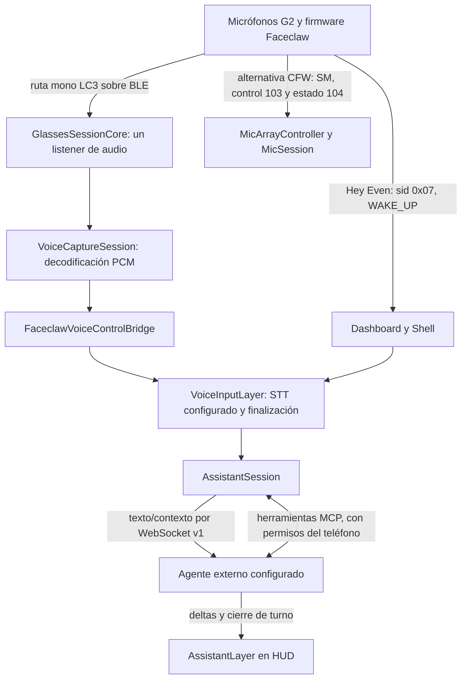
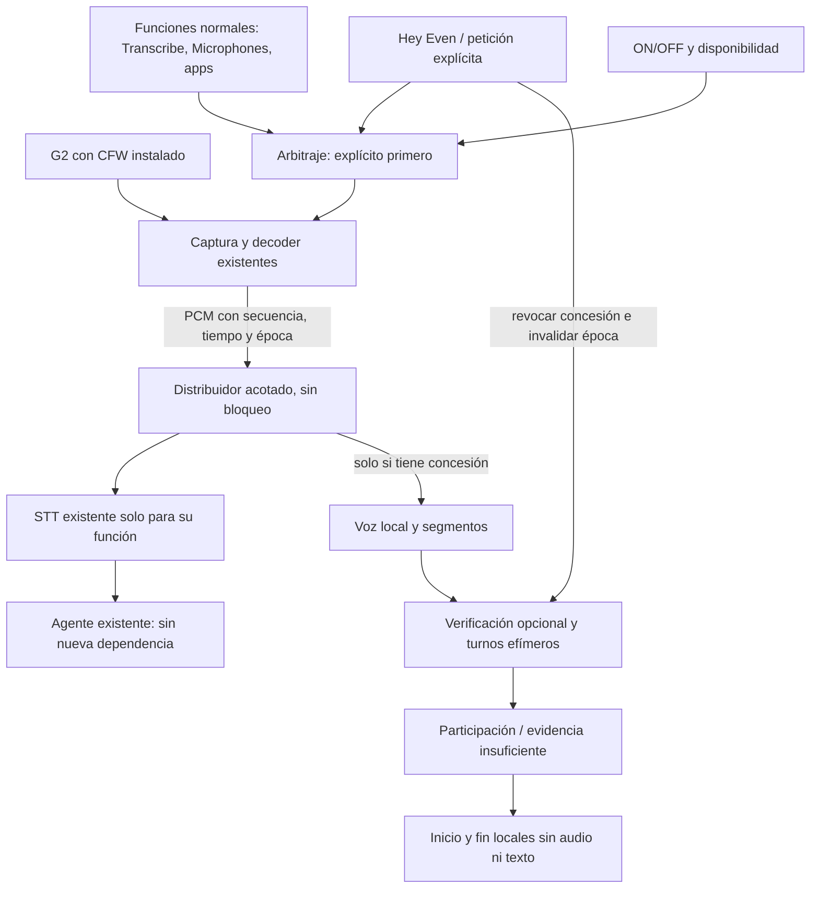

# Auditoría y plan: detección de conversaciones en Faceclaw con G2

Fecha: **3 de octubre de 2026**, Europe/Madrid. Inspección de código y Pixel por USB; revisión documental terminada durante la mañana. Estado: **investigación terminada; implementación y pruebas activas pendientes de aprobación**.

**Actualización posterior del 03-10-2026:** el usuario autorizó expresamente implementación, firma original, actualización sin desinstalar y pruebas activas breves. Se implementó el prototipo G0/G1 en `codex/conversation-detection-g0`; compila y tiene pruebas de software. La firma falta en casa/NAS y no se instaló ni se validó físicamente. Por tanto, G0/G1 no se consideran superadas y G2/VAD sigue pendiente. La restricción de aprobación al final de esta auditoría describía el estado anterior y queda sustituida por esta autorización. Continuación y evidencia: [conversation-detection-g0-results.md](conversation-detection-g0-results.md).

Proyecto: `E:\projects\faceclaw-es`, [DanielGTdiabetes/faceclaw-es](https://github.com/DanielGTdiabetes/faceclaw-es). G2 Companion, G1/Rokid y sus servicios quedan fuera. Se han leído AGENTS.md, README.md, CLAUDE.md, el diseño del asistente y las notas de continuidad. La memoria local se utilizó como orientación histórica.

**Aclaración de plataforma:** el usuario confirma firmware modificado de Faceclaw en las gafas. Faceclaw habla directamente con él por BLE; este plan no depende de la app oficial, la tienda, el SDK JavaScript ni una WebView de Even Hub. El código conserva nombres como `EvenHubSession`: designan una sesión interna del protocolo/firmware que la propia aplicación administra. Sus condiciones de apertura y suspensión sí afectan a las rutas actuales de audio. No deben confundirse con las restricciones del producto oficial.

Etiquetas de evidencia usadas en todo el documento:

| Etiqueta | Significado |
| --- | --- |
| **C** | Comprobado en el código local revisado; no demuestra comportamiento físico. |
| **D** | Observado ahora en el dispositivo mediante consulta de solo lectura. |
| **E** | Documentado por una fuente primaria externa; tampoco demuestra comportamiento en estas gafas. |
| **P** | Propuesta para una fase futura, incluidos límites y criterios de aceptación. |
| **H** | Hipótesis o incógnita. Incluye antecedentes de las notas, identificados como históricos, y declaraciones del usuario cuando no se han medido. |

Los identificadores C01–C20 del apartado 3 fijan archivo, símbolo y líneas. Las fuentes E01–E15 al final fijan versión o referencia y fecha de consulta. No se ha ejecutado ningún ensayo acústico, modelo, instalación, reconexión deliberada ni cambio de ajustes.

## 1. Dictamen de viabilidad y bloqueos

**La captura de conversaciones con G2 está respaldada por productos existentes y Faceclaw tiene una ruta de audio sobre su firmware modificado. Hay una base técnica viable para un prototipo; quedan por validar la integración y la precisión del detector automático propuesto.** La incertidumbre corresponde a la convivencia de esta implementación con Hey Even, su continuidad con pantallas apagadas, la identificación de participación del usuario y el consumo durante una jornada.

### Antecedentes comprobados: Conversate y Mentra Merge

**E13:** Even Realities documenta que Conversate analiza conversaciones en tiempo real, transcribe y muestra ayudas en las G2. Permite seleccionar los micrófonos de las gafas como entrada. Describe inicio por app, menú de las gafas o Hey Even, seguido de pausa y fin de sesión. Esto acredita un uso conversacional soportado del hardware; iniciar con Hey Even no demuestra por sí solo que siga disponible durante toda la sesión.

**E14/E15:** La ficha de Mentra publicada por Mentra Labs declara compatibilidad con Even Realities G2 e incluye Merge como aplicación de IA proactiva. El plan público de Merge-Legacy describe escucha mediante transcripciones, agrupación de intervenciones y selección de ayudas para mostrar en las gafas. Es un antecedente directo de asistencia contextual sobre conversación; ese plan se identifica como referencia de una versión anterior y no acredita que el código actual sea idéntico.

Estos antecedentes corrigen un dictamen anterior demasiado amplio: la capacidad de las G2 para captar conversaciones no es una incógnita general del proyecto. El trabajo de Faceclaw debe aprovechar su captura BLE existente y comprobar los requisitos propios del detector: reconocer participación del usuario, abstenerse ante voces ajenas o reproducciones, respetar el asistente y medir batería. Las fuentes no aportan resultados suficientes sobre esos requisitos. Tampoco introducen una dependencia de Even Hub, de la app oficial o de Mentra en Faceclaw.

Primero construiría, tras aprobación, un ensayo acotado de captura mono existente, apagado y prioridad explícita, sin ASR ni IA. Después una referencia de voz/turnos que todavía no se comercialice como detección de participación. Solo añadiría verificación del usuario si aporta suficiente precisión en español y ruido.

| Bloqueo | Evidencia actual | Método concreto de resolución | Decisión condicionada |
| --- | --- | --- | --- |
| Hey Even durante audio continuo | C02–C07: evento y captura existen; no hay ensayo simultáneo D | Ensayo G0 del apartado 4, con referencias OFF y captura sin inferencia | Si se pierden activaciones, detener la vía automática G2. No arreglarla suponiendo prioridad en software. |
| Audio sin pantalla y ciclo de vida | C03/C08: sesión y ahorro de energía interaccionan; D solo acredita servicio activo | G0 con pantalla del teléfono bloqueada y pantalla G2 apagada por separado | Mantener sesión interna bajo una concesión de audio solo si funciona y el coste es aceptable; nunca forzar pantalla encendida como solución final. |
| Participación, no solo voz | C10–C14: embeddings y segmentación existen; H: precisión en uso real | Comparación etiquetada por episodios, hablante propio frente a ajeno/reproducción | Resultado «evidencia insuficiente» si falta identificación y alternancia. |
| Firmware instalado y ruta multicanal | H: CFW confirmado por usuario, revisión no observada; C15 y E01/E02 describen contrato | Leer revisión ya visible en información de Faceclaw en una fase posterior; cotejar ambos lados y artefacto de firmware | Multicanal no es requisito inicial; no activar ARM_HW por defecto. |
| Consumo móvil/gafas | D: móvil cargando por USB; no hay mediciones incrementales | Cuatro condiciones y repeticiones del apartado 11 | Si captura/transporte dominan, menos inferencias no resuelven autonomía; ofrecer sesiones manuales. |

Alternativa si G0 falla: sesiones iniciadas explícitamente por gesto/PTT y pausadas al usar el asistente, utilizando el flujo normal ya existente. Sirven para investigar detección dentro de una sesión, pero **no cumplen detección automática durante el día**. El micrófono del teléfono sería otra alternativa con aprobación de alcance: diferente posición acústica, más restricciones de captura Android y calidad dependiente de bolsillo/mesa. No se usará como sustitución automática al perder G2.

## 2. Estado del código y dispositivo revisados

### Repositorio

| Dato | Resultado comprobado |
| --- | --- |
| Rama/HEAD local | `spanish-0.8.1`, `5c5e6e60d39c7603a47ea8c52006d5e97331a259`, commit del 02-10-2026 17:13:34 +02:00 |
| Main local y origin/main | `7002e14d911f71d41f3810f8aa364976320635e2` |
| Procedencia inicial de origin/main | Reflog local: actualización por push del 02-10-2026 17:13:41 +02:00. Esa referencia sola no acredita el remoto de hoy. |
| Comprobación remota actual | `git ls-remote` público, sin credenciales del helper, el 03-10-2026: main=`7002e14…`, spanish=`5c5e6e6…`; coincide con ambas referencias locales. No se hizo fetch/pull ni se modificaron refs. |
| Relación por grafo con main | Main tiene 2 commits exclusivos; HEAD tiene 11. Base común `41929308c4c9ebdd9ea4b0449229b8b76972cf91`. Esto es divergencia del grafo, no «11 commits por delante» de una rama lineal. |
| Diferencia relevante | Adaptación española, Whisper base/small, finalización y carga de voz, ubicación, ajustes/importación, clima y documentación. La corrección de ubicación `11ed6ac…` está fusionada en `444a85b…`. |
| Cambios preexistentes | `M notes/continuidad-entre-pcs.md`; `?? notes/asistente-hermes-jarvis.md`. Conservados íntegramente. |
| Cambios de esta auditoría | Solo este documento nuevo. Sin commit, push ni actualización de README/configuración. |

El nombre de paquete npm `1.0.0` no es la versión Android: `app/version.ts:1` declara `0.8.1`; Gradle añade `-es.5` y produce código 805. Código: NativeScript Android 9.1.1 declarado en package.json, compile/target SDK 35, mínimo 24, sherpa-onnx 1.13.0, liblc3 1.1.3, ABI arm64-v8a (C16). Estas son dependencias declaradas del checkout, no versiones de todos los binarios comprobadas dentro de la APK.

### Pixel y artefacto instalado

**D:** Pixel 10 Pro Fold, Android **17 / API 37**, parche de seguridad `2026-09-05`. Paquete `com.faceclaw.app`, `0.8.1-es.5`, código 805, minSdk 24, targetSdk 35. Instalación inicial `2026-10-02 09:39:05`; actualización `2026-10-02 12:26:32` según Package Manager.

**D:** proceso presente y `FaceclawForegroundService` en primer plano, tipos `0x98` (connectedDevice, microphone y location); también está presente el notification listener. Permisos RECORD_AUDIO, BLUETOOTH_CONNECT y POST_NOTIFICATIONS concedidos. Eso no demuestra captura activa, conexión G2 ni conexión Hermes. No se exportaron ajustes ni se leyeron logs de conversación.

**D:** batería 82 %, USB conectado/cargando, temperatura de batería 30,2 °C y tensión 4.324 mV en una instantánea. **Consumo, CPU, PSS, temperatura de CPU, autonomía y discontinuidades: no medido.** No se obtuvo un estado fiable de pantalla con la consulta filtrada; no se atribuye uno.

**D/C:** `sha256sum` del base.apk instalado y `Get-FileHash` de `dist/faceclaw-installed-es.5.apk` coinciden:

`13a50b420c57d7fb790ca7b35e3fa45dd78522d9b1457173d1e9f6918cf9c2f0`

Se examinó en RAM `assets/app/bundle.mjs` de esa copia, sin ejecutarla: contiene `startRawCapture`, `startG2AudioForwarding` y `glassesWorn`; no contiene `location.get_current`, presente en el checkout. Confirma una diferencia relevante con HEAD y respalda la continuidad que sitúa la actualización de ubicación pendiente. **No identifica por sí solo el commit exacto de construcción ni verifica todos los métodos nativos.** Igual versión/código no significa igual aplicación.

**H:** modelo de gafas G2 y CFW indicado por el usuario; revisión instalada y versiones izquierda/derecha no observadas en esta inspección. El checkout requiere `Faceclaw/35`, base stock `2.3.0.24` (C15). El g2flash público consultado anuncia también revisión 35 (E02), pero ni ese anuncio ni el hash del parche incluido prueban que sea el firmware físico instalado.

### Componentes presentes y antecedentes

| Componente | Clasificación y estado |
| --- | --- |
| Faceclaw Android | C: código presente. D: APK y servicio presentes/activos. Uso de voz actual no observado. |
| Firmware CFW | C: parches incluidos y contrato requerido. H: instalación confirmada por usuario, revisión exacta pendiente. |
| Microphones | C: captura mono/multicanal, subtítulos, perfiles y almacén. Algunas cadenas están en APK. Activación, modelos descargados y registro del usuario no observados. |
| faceclaw-agent-bridge / OpenClaw | C: cliente compatible en Faceclaw. H: notas del 02-10 sitúan contenedores NAS parados y datos conservados. No se inspeccionó producción hoy. No hay checkout independiente del plugin localizado en las carpetas examinadas. |
| OcuClaw | H: las notas lo sitúan en OpenClaw NAS, sin servicio tras el paro. No se encontró implementación propia en Faceclaw. No se presume un segundo consumidor activo. |
| Hermes/Jarvis/BMAX | C: adaptador local `E:\projects\faceclaw-hermes-bridge\bridge.py` y README. H: notas del 02-10 indican servicio remoto activo/seleccionado y conexión real entonces. Estado remoto y conexión actual del Pixel pendientes. |

Se ha leído únicamente fuente y documentación pública/no secreta del adaptador. Su archivo local `bridge.py` tiene SHA-256 `9fc979037bf4c80d8eb579a966e12d4013f9ff641ec1228d7174e7eb2b7ce674`; no se comprobó equivalencia con la fuente instalada en Jarvis ni una versión del motor Hermes. No se abrió `private.json`, respaldos XML, keystore, almacenes del móvil ni historia del agente. No se iniciaron sesiones remotas para verificar disponibilidad.

## 3. Flujo actual G2 → Faceclaw → agente, con evidencia



Es el recorrido implementado en código, **no una captura observada hoy**. La ruta CFW multicanal es alternativa a la mono y se cede a la captura del asistente. No se tienen dos propietarios intercambiables que puedan armar el hardware simultáneamente.

| ID | Archivo, símbolo y líneas del checkout | Conclusión C |
| --- | --- | --- |
| C01 | `native/kotlin/shared/src/commonMain/kotlin/com/faceclaw/app/g2protocol/G2Event.kt:14–29`, `decodePayload`; `app/g2/events.ts:23–39`, `EvenAIStatus` | sid 0x07, control/status 1 se entrega como `even-ai`/WAKE_UP. ENTER/EXIT no se equiparan a wakeword. |
| C02 | `app/ui/shell/shell.ts:763–785,1620–1625`, `receiveInput`/conversión de evento | Hey Even abre diálogo manos libres o follow-up según ajuste; puede estar OFF o solo despertar. Si la ventana ya está capturando voz, hay un retorno temprano. |
| C03 | `app/g2/dashboard-controller.ts:793–810,822–844,2240–2264`, `ensureEvenHubSessionActive`, `desiredFaceclawWakeLeaseState`, `handleInputEvent` | Barrera de preparación de sesión/pantalla y concesión CFW que impide que la UI stock desplace Faceclaw. |
| C04 | `app/g2/dashboard-controller.ts:2021–2036,2070–2100`, `voiceCaptureOptions`, `beginVoiceCapture` | El origen es G2 conectado; teléfono solo en preview. Provider, guardado, supresión, beam y verificación se heredan de ajustes existentes. |
| C05 | `app/native/voice-control.ts:84–139,201–217,237–289,518–525`, `FaceclawVoiceControlBridge` | PTT y continuous comparten captura/STT; raw decode-only existe y su captura es preemptada por STT. Los listeners PCM que sigan registrados reciben también muestras de STT; deben retirarse al ceder. Nombre interno `cloud` no implica envío si no hay cloudClient. |
| C06 | `native/kotlin/shared/src/commonMain/kotlin/com/faceclaw/app/g2protocol/session/GlassesSessionCore.kt:443–479,1625–1640`, `startG2AudioCapture`, `stopG2AudioCapture`, `handleRenderNotification` | Un solo `audioPacketListener`; el segundo setter lo sustituye. Habilitación exige sesión lista y layout creado; el STOP espera ACK. |
| C07 | `native/kotlin/shared/src/commonMain/kotlin/com/faceclaw/app/audio/Lc3PacketFramer.kt:21–38,65–90`, `decodePacket`; `VoiceCaptureSession.kt:455–515,663–669` | Paquete mono de 205 B: cinco LC3 de 10 ms/40 B, trailer SSR/ángulo/contador. Sale PCM mono 16 kHz S16LE en chunks de 800 muestras/50 ms. Filtros pueden eliminar/modificar muestras antes del tap. |
| C08 | `app/g2/dashboard-controller.ts:875–950`, `scheduleEvenHubSuspend`; `app/native/voice-control.ts:432–472`, `handleSessionEnded`/`resumeCapture` | Suspensión termina audio. Solo `isCaptureHeld()` impide suspensión: cuenta holders STT, no raw. Raw puede ser suspendido aunque haya intención de escuchar. |
| C09 | `app/ui/shell/voice-input.ts:122–220,414–431`, `startCapture`, `endCapture`, `stopCapture`, limpieza; `shell.ts:1058–1085,1298–1337` | Endpointing detiene dictado; autoenvío depende de ajuste; final tardío y generaciones protegen la entrega. Cerrar overlay cancela turno; puede conservar historial compartido. |
| C10 | `native/kotlin/shared/src/commonMain/kotlin/com/faceclaw/app/audio/CaptionEngineCore.kt:23–116,169–218,242–254`, `CaptionSegmenter`, `UtteranceDecoder`, `CaptionSession` | Segmentación por energía adaptativa, ASR y embedding por utterance. No es una clasificación de participación. |
| C11 | `app/apps/microphones/mic-session.ts:254–325,366–387,530–549,631–645,886–976`, `start`, `handleVoiceActivity`, `startExtended`, manejo de captions | Sesión completa puede iniciar subtítulos/grabación y crear/actualizar perfiles/segmentos. Extended se detiene ante modalidad de voz. Relojes de ambas patillas no se mezclan muestra a muestra. |
| C12 | `app/apps/microphones/speakers.ts:12–22,168–198,209–228,285–310`, `SpeakerRegistry`, `enrollWearer`, `wearerVerificationOptions` | Persistencia en ConversationStore, autoasignación/registro y umbral 0,8 ya existen. Esa política no debe heredarse para el nuevo detector efímero. |
| C13 | `App_Resources/Android/src/main/java/com/faceclaw/app/FaceclawSpeakerId.kt:20–90`, `ensureLoaded`/`embedNullable`; `VoiceCaptureSession.kt:370–372,498–502,680–708` | Extracción CPU, un hilo; buffer de verificación hasta 10 s, verificación al finalizar. No separa hablantes simultáneos. Ante pocas muestras, embedding ausente o error, la ruta actual emite veredicto positivo con similitud 0: no reutilizar ese fallback para confirmar participación. |
| C14 | `app/apps/microphones/mic-models.ts:40–67`, `MIC_MODELS`; `FaceclawCaptionEngine.kt:49–73` | CAM++ ONNX anunciado 29.292.684 B; segmentation ONNX 5.992.913 B; se pueden configurar componentes sin ASR. Presencia descargada no comprobada. |
| C15 | `app/g2/firmware-compat.ts:21–38`; `app/g2/firmware/cfw-patches.ts:1–23`; `app/apps/microphones/mic-protocol.ts:1–21,99–109`; `mic-control.ts:19–29,112–139`; `GlassesSessionCore.kt:893–921` | CFW/35 sobre base 2.3.0.24, control propio campos 103/104, stream SM y lease 90 s. Forwarding no manda audio-control stock, pero aún exige `sessionReady`. |
| C16 | `App_Resources/Android/app.gradle:24–25,259–282`; `App_Resources/Android/src/main/AndroidManifest.xml:41–55,121–126`; `FaceclawForegroundService.kt:51–65,116–134` | Bibliotecas/versiones y permisos; servicio START_STICKY, tipo mic actualmente elegido por permiso, con TODO por origen real. |
| C17 | `app/g2/glasses-presence.ts:9–26`; `dashboard-controller.ts:650–670,1386,1469`; `BleProtocol.kt:724–743`; `GlassesSessionCore.kt:1391–1407,1574–1576` | Worn real del protocolo, nullable por sesión, separado de conectado/cargando. Falta medir fiabilidad física. |
| C18 | `App_Resources/Android/src/main/java/com/faceclaw/app/FaceclawBleCommunicator.kt:378–395`, `updateG2ScreenWakeLock` | Wakelock actual ligado a pantalla G2; no garantiza trabajo del detector con G2 dormida. |
| C19 | `app/assistant/bridge-client.ts:125–151,253–269,282–307`; `app/assistant/session.ts:101–152,199–209` | Envía texto/contexto, turnId, cancel; desconexión/timeout producen error. Reconexión con backoff existente no es una cola de eventos del detector. |
| C20 | `E:\projects\faceclaw-hermes-bridge\bridge.py:113–175,188–194,234–260,264–272`, `create_agent`, `cancel`, `handle`, `turn`; notas Hermes del 02-10 | Adaptador local Hermes AIAgent y protocolo v1, herramientas MCP, cancelación. No prueba servicio remoto instalado/activo hoy. |

Los enlaces de fuente del checkout se pueden construir con `https://github.com/DanielGTdiabetes/faceclaw-es/blob/5c5e6e60d39c7603a47ea8c52006d5e97331a259/<ruta>#L<n>`. Los cambios locales mencionados son documentación y no alteran estas líneas de código. Por ejemplo: [captura mono](https://github.com/DanielGTdiabetes/faceclaw-es/blob/5c5e6e60d39c7603a47ea8c52006d5e97331a259/native/kotlin/shared/src/commonMain/kotlin/com/faceclaw/app/g2protocol/session/GlassesSessionCore.kt#L443), [arbitraje actual](https://github.com/DanielGTdiabetes/faceclaw-es/blob/5c5e6e60d39c7603a47ea8c52006d5e97331a259/app/native/voice-control.ts#L237), [wakeword](https://github.com/DanielGTdiabetes/faceclaw-es/blob/5c5e6e60d39c7603a47ea8c52006d5e97331a259/app/ui/shell/shell.ts#L763).

## 4. Hey Even, propiedad actual del audio y respuestas a los bloqueos

| Pregunta | Respuesta basada en evidencia |
| --- | --- |
| ¿Puede obtener audio durante el tiempo necesario? | C: captura continua y raw existen. H: duración utilizable, estabilidad y batería no demostradas. |
| ¿Origen/formato/transporte? | C: G2 por notificaciones BLE, LC3 mono → PCM16LE/16 kHz. Ruta alternativa CFW SM multicanal; formato efectivo se lee del frame, no del ajuste solicitado. Teléfono usa AudioRecord VOICE_RECOGNITION/mono 16 kHz solo en preview (AndroidSpeechEngines.kt:103–136). |
| ¿Quién captura? | C: bridge → VoiceCaptureSession → único listener de GlassesSessionCore; firmware captura/codifica. Extended tiene MicArrayController propio y sustituye la ruta mono, con pausa al diálogo. |
| ¿Quién inicia/detiene? | C: UI/holders o raw armados; audio-control y ACK para mono; campos 103/104 y lease para extended; cierre, endpointing, pérdida de sesión y suspensión terminan/interrumpen. |
| ¿Cómo llega Hey Even? | C: clasificación declarada en firmware, evento sid 0x07/status 1, parser nativo, dashboard, Shell, diálogo, STT, envío de texto, turno de agente y overlay. El modelo de wakeword no se ha auditado ni medido. |
| ¿Llega mientras otro procesa audio? | H: no demostrado. Que exista el evento, la lease o la pausa de Microphones no demuestra que el clasificador siga recibiendo muestras. |
| ¿Puede compartirse sin disputar micrófono? | C: dentro de STT hay holders y tap PCM. P: ampliar a consumidores con concesiones; no crear un segundo listener/controlador. No usar continuous STT para audio local del detector. |
| ¿Bloqueo, segundo plano, desconexión? | D: FGS actual; C: hay suspensión/reanudación y wakelock de pantalla. H: continuidad física y Doze pendientes. Desconexión debe invalidar toda evidencia. |
| ¿Puestas o conectadas? | C: worn nullable procedente de evento real. H: sensor instalado, pérdidas y falsos positivos pendientes. No se debe reducir worn a conexión BLE. |

**Límites por capa.** Hardware: acústica de patillas, relojes separados y sensibilidad real pendientes. Firmware: ciclo de captura y wakeword pueden compartir recursos; CFW amplía capacidad, pero no prueba simultaneidad. SDK: aquí la interfaz relevante es Kotlin/JNI y protocolo BLE propio, no el SDK oficial de Even Hub. Aplicación: único listener, raw sin holder de ahorro de energía, callbacks en hilo principal y finalización síncrona de hasta 1.500 ms en `VoiceCaptureSession.stop()` (323–337) son límites verificables que hay que tratar.

**C/H: origen por patilla todavía pendiente.** `VoiceCaptureSession.queueAudioPacket` (747–765) incrementa `wrongArmPackets` cuando la etiqueta no es L, pero encola igualmente el paquete. El framer lleva un solo contador. No afirmar que se descarta la patilla derecha ni que llegan micrófonos independientes por esa ruta; G0 debe registrar únicamente arm/secuencia/tamaño y confirmar si hay un emisor o duplicados. Si llegan dos flujos independientes, hay que segregarlos antes de decodificar/analizar y medir, sin mezclar relojes. El origen G2 está implementado; qué micrófonos físicos alimentan el PCM instalado no se ha observado.

**G0, experimento mínimo propuesto, no ejecutado.** Identificar revisión de ambos lados y ajuste real de wakeword; usar frases artificiales sin contenido privado. Referencia OFF, después captura mono decode-only sin ASR/red/disco, luego captura más un consumidor artificial lento limitado. Sesiones de 10–15 min y un bloque de 30 min con teléfono bloqueado/G2 apagada, con 20 invocaciones por condición como cribado, distribuidas durante silencio y voz; ampliar a 100 por condición para aceptar. Marcar el instante de pronunciación sin grabarla; registrar timestamps de evento BLE, cesión, mic listo, primer PCM y UI. Comparar pérdidas y p50/p95 con OFF. No basta inyectar evento sintético: eso solo prueba software posterior a la detección física.

Si la captura mono funciona con Hey Even, avanzar por esa ruta. Si no, parar y localizar si desaparece evento o falla entrega/cesión. Solo evaluar SM en ensayo separado si revisión y garantías de hardware lo justifican; no activarlo para «ver si arregla» una pérdida de wakeword. E01 declara ABI todavía pendiente, tasa efectiva fija y truncación potencial; no se ha demostrado que su control independiente mantenga el clasificador. Una posible modificación futura de firmware sería un alcance propio con revisión y recuperación explícitas, no la primera fase de este plan.

La activación explícita debe seguir funcionando aunque Hermes esté caído. Garantiza recepción, diálogo y error claro; **no garantiza respuesta remota**. La nueva función no añadirá consultas al agente ni condicionará el wakeword a red/modelos del detector.

## 5. Arquitectura propuesta y diagrama

**P: decisión provisional**: Android local, mono 16 kHz, decode-only, aprovechando el comunicador y decoder existentes; detector en trabajador nativo con un propietario único de captura. Se amplía el arbitraje del bridge actual, conservando contratos de STT. La elección depende de G0. No se instala ni modifica firmware como requisito.



`AudioCaptureArbiter`, `ConversationDetectionCoordinator`, `ConversationDetectorCore` y `ConversationEvent` son **nombres propuestos**, no clases existentes. No es necesario un bus general ni microservicios: concesiones tipadas, colas pequeñas y un trabajador bastan.

OFF no solicita ni conserva audio, tap, worker, modelos, temporizadores, buffers ni reintentos atribuibles al detector. Liberará únicamente su concesión; otros usuarios conservan sus recursos. El servicio de Faceclaw puede seguir activo por su función normal. ON expresa preferencia, no promesa de escucha: disponibilidad requiere firmware/ruta compatibles, BLE y sesión válidos, permisos, worn verdadero de sesión actual, no cargando y ausencia de propietario prioritario.

ON con `worn=null` permanece suspendido. Por defecto no usar conexión como aproximación. Debounce propuesto: ON_HEAD estable 1 s para abrir; OFF_HEAD/carga/desconexión detienen inmediatamente. Evento worn no necesita caducar cada pocos segundos si es un sensor por cambios: la validez se liga a sesión y liveness del transporte; pérdida de salud obliga a desconocido. Validar transición al ponerse, quitarse y guardar en estuche. Una ausencia total de worn en el dispositivo obligaría a sesiones manuales o a un modo explícito por conexión cuya limitación se explique y apruebe.

Primer incremento suspende detector durante todo uso de voz explícito y funciones de audio normales. Puede compartir infraestructura/decodificación sin consumir muestras de la sesión explícita. No debe provocar ASR, grabación o subida por retener un holder STT. Cuando una función normal ya posee audio, el detector solo podría consumirlo en una fase posterior si su contrato y privacidad están comprobados; inicialmente cede.

## 6. Máquina de estados y reglas de arbitraje

Preferencia persistente `enabled=false` por defecto. Disponibilidad separada: `unavailable(reason)` o `available(sessionEpoch)`. Estado operativo se calcula a partir de ambas, sin reescribir ON a OFF por una desconexión.

| Estado P | Evento de entrada | Condición/transición | Recursos activos | Temporizadores P | Acción de salida | Error |
| --- | --- | --- | --- | --- | --- | --- |
| Deshabilitado | OFF, primer uso | ON → suspendido/evaluación | Ninguno del detector; solo integración de ajuste | Ninguno | Crear coordinator solo si ON | No reintentar ni abrir mic |
| Suspendido/no disponible | ON sin condiciones, unwear, desconexión, permisos, propietario normal | Disponibilidad válida estable → espera; OFF → deshabilitado | Estado/reason; sin PCM, modelos o inferencias | Debounce 1 s; backoff solo recuperación técnica | Nueva época, concesión y sesión; no reutilizar buffers | No mostrar «detectando» si no llega audio |
| Espera | Concesión y primer PCM válido | Voz suficiente → candidata; pérdida/OFF → liberar | Captura decode-only, VAD, ring acotado | Watchdog audio 2 s; decisión 1 Hz | Abrir ventana candidata con tiempos monotónicos | Hueco/overflow invalida ventana |
| Conversación candidata | Patrón hablado | Usuario+otro+alternancia suficiente → confirmada; evidencia insuficiente/expira → espera | Los de espera; embedding por segmentos si consentido | Confirmación inicial 5–10 s; caducidad candidata 15 s | Solo al confirmar emitir inicio | No emitir inicio con perfil ausente, mezcla o modelo fallido |
| Conversación confirmada | Evidencia temporal aceptada | 20–30 s sin intercambio respaldado → espera; explícito/pérdida/OFF → fin interrumpido | VAD y evidencia reciente; ninguna transcripción | Silencio y pérdida de participación; máximo técnico 30 min renovable con evidencia | Emitir un fin por episodio; borrar referencias efímeras | No sostener estado por voces ajenas indefinidamente |
| Interacción explícita | Hey Even, PTT, teclado al agente o overlay explícito | Cierre/cancel/error de interacción y audio libre → suspendido/espera nueva | Cero recursos del detector; recursos del asistente pertenecen a su función | Límite propio de sesión existente; sin espera remota del detector | Reiniciar evidencia al reanudar; no restaurar episodio viejo | Error remoto no retiene concesión del detector; recuperación depende del cierre de UI |
| Recuperación de error | Flujo perdido, worker/modelo defectuoso | Reinicio técnico acotado si sigue ON/usable; falta permiso → suspendido; repetición → error enclavado | Sin captura/modelo del detector tras limpieza; contador de fallos | Reintentos 2, 5, 15 s; máximo 3 por 5 min | Nueva época y puesta a cero | Requiere intervención explícita al superar presupuesto; no reinicia servicios |

Histéresis P: VAD onset/release diferentes; entrada de participación exige más evidencia que mantenimiento. Cooldown de 10 s tras fin normal, pero nunca bloquea Hey Even. Una decisión por segundo; máximo 6 inicios automáticos por minuto, después suspender con motivo de inestabilidad. No reducir falsos positivos escondiendo episodios que habrían activado: contabilizar también candidatos y supresiones por límite. Cada episodio tiene un identificador RAM y un único inicio/fin.

Confirmación de 5–10 s y fin tras 20–30 s son hipótesis. Mayor confirmación reduce activaciones por ruido breve y retrasa/pierde diálogos cortos; mayor silencio de fin fusiona conversaciones y mantiene estado obsoleto. Ajustar en conjunto de calibración buscando precisión/latencia por escenario; congelar antes de evaluar. En ruido, el temporizador de fin usa tiempo sin evidencia de intercambio/participación, además de silencio global: no se espera silencio absoluto de un restaurante.

### Mecanismo propuesto de prioridad

1. **Hey Even > funciones normales > detector.** El evento físico se procesa por la ruta existente. Antes de abrir diálogo, el arbitraje revoca de forma atómica la concesión del detector, incrementa `epoch`, impide nuevas inferencias/eventos y pone fin a un episodio confirmado con `explicit_interruption`. No se espera a un modelo.
2. El decoder/comunicador mantienen un único propietario. El detector no instala otro `audioPacketListener`. Con ruta mono compartible se retira su tap sin apagar lo que el asistente necesita; si hay que cambiar modo, esa transición se serializa en trabajador nativo fuera del hilo de UI. STOP viejo nunca puede apagar una concesión nueva.
3. Extended, si algún día se valida, debe parar stream/lease antes de captura mono; no mezclar frames SM con Lc3PacketFramer. Es el patrón de C11, pero se debe acreditar la entrega física de Hey Even antes de confiar en él.
4. Cada muestra, trabajo y resultado llevan época y rango de secuencias. OFF, explícito, ruta distinta, pérdida de transporte, interrupción o nueva sesión invalidan época. Un resultado tardío se descarta aunque el runtime no pueda abortar su cálculo.
5. La inferencia usa cola máxima un trabajo en curso y uno pendiente reemplazable; ninguna espera de embeddings en callback BLE/main. Si el worker se bloquea, supervisor revoca concesión, suprime entrega y libera el audio por una ruta independiente. Se exige límite del runtime; abandonar resultados no equivale a detener CPU ni borrar memoria.
6. Al reanudar: concesión nueva, VAD/estado recurrente reiniciados, perfiles temporales y buffers vacíos, warm-up de ruido de 1–2 s sin confirmar. La preferencia ON no recupera una candidata antigua.

**Límites iniciales P:** cola PCM del detector ≤250 ms, ring mono ≤10 s (320.000 B), máximo dos copias de ventana en cálculo; backlog de decisión ≤1 s; un evento de fin nunca queda bloqueado por inferencias. La cola actual de VoiceCaptureSession es 80 paquetes/4 s nominales (C07): no aumentar y no considerar suficiente ese límite para prioridad. Incorporar antigüedad máxima y backpressure en la ruta detector; tampoco la cola de callbacks hacia JS se presume acotada por limitar la cola nativa. Overflow/hueco reinicia evidencia y se registra como discontinuidad, sin rellenar artificialmente para fabricar turnos.

Verificación: tests con orden adverso ON/OFF/wake/stop/ACK, epoch y worker colgado; después hardware compara evento, preparación y pérdidas de wake frente a OFF. La lease CFW controla UI/fallback; por sí sola no es una garantía de que el clasificador siga activo.

## 7. Estrategia para detectar participación y límites

Cuatro tareas distintas:

| Tarea | Qué responde | Qué no acredita |
| --- | --- | --- |
| Detección de voz/VAD | Hay señal compatible con habla en este tramo | Identidad, destinatario ni presencia física del emisor |
| Segmentación/diarización aproximada | Hay turnos y grupos acústicos diferentes | Que un grupo sea el usuario o que esos grupos conversen entre sí |
| Verificación del usuario | Un tramo limpio se parece al perfil registrado | Que sea voz en vivo, que dialogue, o separación de una mezcla |
| Inferencia de participación | Voz propia y otra voz se alternan con evidencia temporal suficiente | Significado, relación social, compromisos o autorización para acciones |

**P: pipeline básico.** PCM válido → calidad/clipping/huecos → VAD → segmentos con inicio/fin y pausas → opcional embedding por segmento limpio → agrupación efímera y etiqueta propia/otra/desconocida → regla de intercambio. No transcribir para encontrar palabras ni consultar LLM para decidir silencio.

Señales implementables en mono: energía RMS y piso de ruido aproximado, clipping, duración/duty-cycle, pausas, secuencia de segmentos, embeddings y similitud. SNR estimada usa un piso aprendido durante no voz; falla cuando el ambiente nunca calla y no es una medición física de distancia. La voz dominante/cercana aporta calidad acústica, **no identidad**. No dividir hablantes solo por cambios de volumen: orientación, distancia, reverberación y movimientos alteran la misma voz.

Punto de partida para intercambio, **hipótesis calibrable**: al menos una secuencia usuario–otro–usuario o otro–usuario–otro dentro de 10–15 s, dos grupos distinguibles y al menos un turno propio de suficiente duración y confianza. Preferir dos turnos propios separados para mayor precisión, aunque se pierdan respuestas breves. Segmentos útiles inicialmente 1–3 s de voz y gaps de respuesta aproximadamente 0,2–4 s. No confundir una pausa con un cambio de identidad. Detectar alternancia dentro de habla continua requiere un modelo de cambio de hablante o ventanas de embedding; VAD puro no la resuelve. Primera referencia puede perder esos intercambios y debe declararlo.

Para identidad P: separar «coincide», «no coincide» y «desconocido». Exigir margen entre propio y otro y continuidad en varios segmentos; no interpretar bajo score propio como prueba de interlocutor distinto. El umbral 0,8 actual es C, no un parámetro validado aquí. Evaluar falsos aceptados/rechazados de hablante en el canal G2 y calibrar el margen. Agrupación temporal de un máximo de 4 centroides efímeros, sin nombres ni actualizaciones del perfil registrado. Más grupos/mezcla degradan confianza, no fuerzan veto por multitud.

Solapamiento: en mono la mezcla puede producir embeddings falsos; un cambio de embedding o VAD positivo no demuestra dos hablantes. Sin modelo validado de overlap no afirmar que se mide. Usar calidad inconsistente como desconocida; añadir segmentation-3.0 solo si mejora errores concretos. DOA/SSR del trailer existen en C07; ayudarían a consistencia/orientación únicamente tras validar. En multicanal podrían ayudar procesamiento por pareja y relación entre canales, pero hay incertidumbres de formato, continuidad y asignación física (E01). No deducir usuario, distancia ni presencia real solo de DOA.

### Registro del usuario y datos persistentes

**P, consentimiento específico pendiente antes de habilitar verificación.** La opción principal continúa OFF por defecto. Registro voluntario local: 3–5 frases distintas de 5–8 s con G2 puesta, sin interlocutores, en entorno tranquilo; aceptar solo 10–20 s de voz de buena calidad total, hacer embeddings por segmentos, normalizar y promediar. Una comprobación independiente posterior, de frases diferentes, acredita consistencia; puede rechazarse y repetirse. Son cantidades iniciales a calibrar, no requisitos de CAM++ publicados.

Persistir solo el centroide propio, identificador/hash del modelo, dimensión, versión del formato y parámetros técnicos necesarios. Con 512 float32 serían 2.048 B de vector antes de formato/cifrado; memoria total del modelo y proceso **no medida**. No guardar frases, transcripciones, embeddings de terceros ni muestras originales. Mantener un almacén propio en almacenamiento privado, protegido con clave Android Keystore; excluirlo de backup/exportación. El manifest actual permite backup (C16): una carpeta privada sola no demuestra exclusión de copias. Revisar reglas específicas antes de aprobar persistencia.

OFF libera embedding/modelo en RAM pero conserva perfil consentido para próxima activación. «Borrar mi perfil» elimina el dato persistente, clave asociada si es exclusiva y toda copia RAM; desactiva verificación. Es separado de OFF y no borra perfiles históricos de Microphones. Deshabilitar reconocimiento suspende la confirmación automática de participación; no elimina silenciosamente el perfil. No importar el perfil del registro existente sin consentimiento específico ni ejecutar `SpeakerRegistry.assign()`, que puede crear terceros y actualizar base de datos (C12).

Coste P: cargar CAM++ una vez durante modo usable, CPU de un hilo, solo segmentos útiles, como máximo una extracción por 2 s y una pendiente; cero trabajo en OFF/suspendido. El mínimo aproximado de 0,5 s en el adaptador actual no acredita calidad de identificación. Latencia/energía/RAM en este Pixel **no medidas**. No adaptar el centroide automáticamente a audio ambiental: podría incorporar voces ajenas.

Sin registro, perfil incompatible, modelo ausente, baja confianza o audio mezclado: **evidencia insuficiente; no inicio automático**. El prototipo básico puede informar voz/actividad candidata solo en evaluación técnica. Sesiones marcadas manualmente por el usuario son una alternativa usable sin dato biométrico, con menor automatismo.

El veredicto de comandos existente es permisivo ante falta de muestras/error (C13), para mantener su flujo de uso. El detector propuesto debe tener su resultado ternario propio y no cambiar esa política del asistente como parte de reutilizar el extractor. Un `true` con similitud 0 no acredita que haya hablado el usuario.

### Escenarios acústicos

| Escenario | Señales que podrían ayudar P | Riesgo y respuesta |
| --- | --- | --- |
| Bar/restaurante sin participación | Falta de voz propia, falta de alternancia consistente | Varias voces nunca bastan. Ignorar/insuficiente. |
| Conversación propia dentro de bar | Turnos propios limpios intercalados con otro grupo; VAD/embeddings de calidad | Admitir candidata aun con muchas voces. Si mezcla destruye evidencia, abstenerse; medir sensibilidad aparte. |
| Transporte/tráfico | Piso de ruido, clipping, SNR aproximada; segmentos | Tráfico impulsivo produce falsos VAD; bajar confianza y seguir buscando participación, sin veto total de entorno. |
| Oficina/conversaciones ajenas | Perfil propio ausente | Usuarios vecinos pueden ser dominantes; intensidad no prueba participación. |
| TV/radio/podcast | Clases acústicas y textura podrían ayudar; perfil propio ausente normalmente | Un programa puede imitar turnos presenciales. No hay prueba fiable de presencialidad desde mono. |
| Usuario que habla ante TV | Perfil propio más diálogo del televisor parece intercambio | Caso adverso obligatorio. No prometer distinguirlo siempre; abstención o sesión manual si falla. |
| Reproducción de voz del propio usuario | Coincidencia de embedding | Verificación no es anti-replay. Incluirla en negativos; autenticación acústica no resuelta. |
| Música sin voz / con voz | VAD, tonalidad, clasificador si se justifica | Canto puede parecer habla y varias voces; no iniciar sin evidencia propia de intercambio. |
| Usuario hablando solo | Un grupo propio, falta otro grupo verificable | Ignorar; cambios de tono no deben fabricar otro hablante. |
| Voces simultáneas | Calidad/consistencia, overlap solo con modelo validado | Devolver insuficiente antes que clasificar una mezcla como usuario. |

YAMNet podría recortar falsos candidatos de música/tráfico. No decide televisión frente a persona real de forma garantizada, ni cambia la necesidad de reconocer al usuario. Evaluar su aportación por ablación sobre los mismos episodios; no incorporarlo si solo añade CPU o elimina conversaciones válidas ruidosas.

## 8. Comparación y selección provisional de modelos

**Modelo y runtime son decisiones distintas.** WebRTC VAD es un algoritmo C, Silero un modelo, CAM++ un modelo de embedding y YAMNet un clasificador. ONNX Runtime/sherpa-onnx y LiteRT/TFLite ejecutan modelos; no detectan conversación por sí solos. Todo dato de consumo en este Pixel o las gafas es **no medido**.

| Opción | Función y adaptación al audio | Tamaño y memoria | Ejecución, Android y aceleración | Licencias/mantenimiento | Límites |
| --- | --- | --- | --- | --- | --- |
| Energía adaptativa existente, sin modelo adicional | Referencia de voz/segmentos; PCM16 mono directo, reutilizar lógica `CaptionSegmenter` sin arrancar captions/store/ASR | Sin pesos nuevos; buffers y estado pequeños, RAM real no medida | Kotlin, O(n); chunks actuales 50 ms. CPU/latencia/energía no medidas. Sin GPU/NPU necesaria | Código propio GPLv3. Ya presente C10; mantenimiento del proyecto | Confunde ruido/música, pierde cambios dentro de voz continua. No identidad ni participación. |
| WebRTC VAD | Voz binaria. Refragmentar 800 muestras a frames de 160/320/480 muestras a 16 kHz, conservar residuo y reloj | Sin pesos descargables; tamaño binario/JNI y memoria no medidos | C/JNI en Android, modos 0–3; propuesto 20 ms/50 decisiones por s. CPU, sin necesidad inicial de aceleración; coste no medido | BSD-style, conservar LICENSE/PATENTS/AUTHORS; upstream WebRTC. Pin de fuente pendiente; no adoptar wrapper sin revisar licencia/mantenimiento. E03 | No identifica hablante; agresividad sacrifica sensibilidad. Español y ruido G2 no evaluados. |
| Silero VAD v6.2 | Probabilidad de voz; convertir S16LE a float normalizado y alimentar 512 muestras/32 ms a 16 kHz, estado recurrente por época | README: JIT alrededor de 2 MB; tamaño ONNX exacto y RAM a fijar/no medidos | ONNX en runtime móvil; ~31,25 ventanas/s, todas en orden. Publicado <1 ms/chunk en CPU de referencia, **no benchmark Pixel**. Empezar CPU 1 hilo; EP/aceleradores solo tras ensayo. E04–E06 | MIT código/modelo publicado. Tag v6.2 `be95df…`; adaptar binding JNI/API disponible, no actualizar sherpa automáticamente | VAD general multilingüe publicado; no métrica específica de español/G2. No participación ni identidad; energía no medida. |
| CAM++/WeSpeaker mediante `FaceclawSpeakerId` | Verificación y agrupación aproximada de segmentos limpios; float 16 kHz, comparar perfil propio por coseno | C14 anuncia 29.292.684 B ONNX (~27,94 MiB); centroide según dimensión, código comenta 512. RAM/PSS no medidos | API Android ya presente, CPU 1 hilo explícito. P: 1–3 s voz, ≤0,5 extracciones/s. Latencia/CPU/energía no medidos; no asumir aceleración del runtime empaquetado | sherpa código Apache-2.0; WeSpeaker código Apache-2.0; ficha del creador CAM++ etiqueta Apache-2.0 (E07/E08). Verificar licencia/procedencia del archivo espejo exacto y conservar avisos antes de distribuir | VoxCeleb EN publicado; español/ruido/replay en G2 no evaluados. Embedding mixto no diarización fiable. Requiere consentimiento/registro. |
| pyannote segmentation-3.0, opcional | Segmentación local y overlap en ventanas, luego embeddings/clustering para continuidad; no identidad propia | C14 anuncia conversión ONNX 5.992.913 B (~5,72 MiB); RAM no medida | Fuente: 10 s mono/16 kHz, tres hablantes/ventana y hasta dos simultáneos. ONNX/sherpa Android posible pero adaptación streaming pendiente; P: ventana cada 5 s solo en candidata, CPU inicial | Pesos originales MIT, acceso original sujeto a condiciones; código y conversión concreta requieren revisión separada (E09). No se descargó ni aceptó acceso | Diarización completa no resuelta solo con este modelo. Latencia y consumo Pixel no medidos. Mayor complejidad y buffers; no primera opción. |
| YAMNet, opcional | Clases de entorno para auxiliar calidad/ruido; mono float a 16 kHz | Publicado 3,7 M pesos: ≈14,8 MB de valores float32, **estimación**, no tamaño TFLite ni RAM. Archivo concreto pendiente | 521 clases, ventana 0,96 s/hop 0,48; publicado 69,2 M multiplicaciones por ventana. E10. Android vía LiteRT AudioClassifier (E11); P: 1 ventana cada 5 s, sin prometer aceleración de STFT/ops | Código TensorFlow models Apache-2.0; verificar licencia del artefacto de pesos/version TFLite antes de incluir. Mantenimiento Google; no conversión/instalación hecha | No verifica usuario ni presencialidad. Calidad en español/ruido específico y batería no medidas. |

**Selección P:** energía adaptativa como control mínimo y **WebRTC VAD** como primera opción de voz por integración pequeña y ausencia de un runtime adicional. El escalón de participación añade CAM++ ya integrado solo con consentimiento y si la evaluación demuestra mejora; no utiliza ASR. **Alternativa de voz: Silero v6.2**, si WebRTC no logra los negativos de música/ruido sin perder sensibilidad. El runtime ONNX ya presente podría reducir coste de integración, pero no demuestra que el JNI vendorizado exponga VAD: revisar bindings antes de escoger.

Cambiar a Silero solo si mejora sensibilidad al mismo presupuesto de falsas activaciones, sin romper prioridad ni exceder coste. Añadir segmentation para casos de cambio/overlap que sigan fallando, y YAMNet solo si reduce ≥30 % de falsos candidatos/activaciones en sus escenarios con pérdida de sensibilidad ≤5 puntos porcentuales y coste dentro del presupuesto. Son umbrales P de utilidad, no resultados. Si CAM++ no permite distinguir voz propia en ruido/replay, no sustituirlo por un LLM continuo: conservar «insuficiente» o cambiar a activación manual.

ONNX Runtime Mobile documenta Android y proveedores de ejecución; soporte de operadores, versión y dispositivo condicionan aceleración (E06). La presencia de libonnxruntime.so no confirma versión exacta ni NNAPI/XNNPACK en este APK. No duplicar bibliotecas nativas ni actualizar runtime para esta fase. El VAD/state no se debe ejecutar cada 5 s omitiendo frames: esa frecuencia es para decisión agregada o un clasificador auxiliar, no para escuchar solo trozos y pretender continuidad.

## 9. Privacidad, buffers y contrato de eventos

**P: detector sin clientes de red, ASR, transcripción, almacenamiento de conversaciones ni herramientas del agente.** Audio únicamente en buffers RAM acotados; no dumps de arrays, texto o embedding en logs/crash reports. No usar los ajustes generales `saveRecording` o provider cloud para arrancarlo. El modo nativo llamado `cloud` puede servir como decode-only sin cliente de red (C05), pero debe tener un wrapper inequívoco y verificarse que no se conecta al cliente STT.

Presupuesto mono P: ring de 10 s/320 kB más máximo dos ventanas de igual tamaño (total PCM ≤960 kB), cola 250 ms/8 kB, residual de VAD y metadatos/centroides ≤64 kB; objetivo de buffers de audio/características <1,1 MiB. No incluye pesos ni runtime. Reducir ring a 3–5 s si basta CAM++/VAD; ampliar a 10 s solo justificado por ventanas. Cualquier ruta multicanal multiplica memoria y transporte: no reutilizar estos límites sin calcularlos.

Al terminar segmento, retener muestras solo hasta concluir trabajo vigente o caducidad ≤1 s de backlog. Sobrescribir ring al circular, borrar ventanas al liberar, reiniciar estado de modelo al suspender. No prometer borrado físico inmediato de copias internas del runtime: hay que instrumentar allocators/lifecycle, cerrar sesiones y comprobar referencias; un worker que siga computando no satisface «OFF libera todo». Modelo sin cancelación/deadline/lifecycle aceptable no pasa el criterio OFF. Persistencia del perfil propio se trata por separado en apartado 7.

Métricas permitidas con aceptación del usuario para ensayos: conteos de paquetes, gaps/decode errors, duración agregada de voz, profundidad máxima, tiempo de inferencia, cambios de estado/reason, número de inicios/fines, tiempos de cesión/liberación, CPU/PSS/batería/temperatura. Sin nombres de hablantes, embeddings, ángulos persistidos, textos, localización ni identificadores estables. Timestamps de episodios también revelan hábitos: solo RAM en producto inicial; guardar métricas temporales de evaluación en archivo técnico explícito y borrar al cerrar el ensayo, conservando agregados si se acuerda. No activar telemetría nueva por defecto.

Contrato **propuesto, local, versionado y sin integración remota inicial**:

```ts
type ConversationEvent =
  | { v: 1; type: "conversation.start"; episodeId: string; atMonoMs: number }
  | { v: 1; type: "conversation.end"; episodeId: string; atMonoMs: number;
      reason: "silence" | "participation_lost" | "explicit_interruption" |
              "unavailable" | "disabled" | "error" };
```

ID aleatorio por episodio/proceso, sin identidad personal. Inicio significa confirmación de evidencia, no comienzo exacto del diálogo; no retrofechar ni adjuntar PCM de pre-roll. Fin solo si hubo inicio. `insufficient` es un resultado local del detector, no un evento de conversación confirmado. La época se usa internamente para descartar eventos caducados. Sin topic, ubicación, nombres, textos, confidence biométrica o embedding.

Entrega local síncrona ligera o cola máxima de dos eventos/último par, orden y deduplicación por episodeId. Consumidor bloqueado se desacopla; pierde notificaciones con contador y puede consultar estado local actual. No persistir cola ni replay al arrancar. No llamar `sendUtterance` con esos eventos. Una futura integración con Hermes podría establecer TTL y cola/handshake propios, pero pertenece a fase separada. Si BMAX/Hermes no responde, no hay espera, reintento ni acumulación en el detector.

Un evento acústico solo indica un episodio estimado. **Hermes no puede interpretar compromisos, tareas ni fechas a partir de él.** Esa fase requeriría texto/audio o notas introducidas explícitamente, contexto y hablante, modelo semántico, consentimiento de envío/retención y política de confirmación de acciones. Podría ser local o remota; cambia sustancialmente privacidad y coste. No se propone modificar puentes, OpenClaw u OcuClaw ahora. Voces/transcripciones son siempre datos, no autorización de herramientas.

Privacidad atribuible: las funciones habituales pueden ya enviar voz o guardar sus sesiones según sus ajustes. El ensayo del detector debe aislar su contribución, sin cambiar esos ajustes por esta auditoría. Si el detector por sí mismo enciende STT, captions, registro de terceros, guardado o logs de contenido, falla aunque esos componentes ya existieran.

## 10. Permisos y ejecución Android

**C/D:** ya existen permisos y servicio foreground; no se concedió ni modificó ninguno. El target 35 corre en API 37. BLE externo de G2 y AudioRecord del teléfono son rutas distintas: no trasladar automáticamente todas las restricciones de AudioRecord a un stream recibido por BLE. El bridge actual pide RECORD_AUDIO también para G2 y el servicio reclama tipo microphone por permiso, con TODO por origen (C04/C16); es un hecho de aplicación que debe revisarse sin recortar el comportamiento normal.

**E12:** Android exige tipos/permisos apropiados para FGS y aplica restricciones de inicio desde segundo plano y de permisos while-in-use para micrófono. Una excepción por dispositivo compañero depende de configuración real, no de tener Bluetooth conectado. Fuente oficial consultada: [tipos de servicio](https://developer.android.com/develop/background-work/services/fgs/service-types), [inicio desde segundo plano](https://developer.android.com/develop/background-work/services/fgs/restrictions-bg-start).

**P:** ON inicial se activa desde UI visible con permisos verificados, indicador claro y acción OFF accesible. No lanzar captura automáticamente desde BOOT_COMPLETED, receptor ADB, permiso recién restaurado o un error de servicio. Tras muerte/reinicio de proceso, preferencia puede seguir ON pero estado suspendido hasta activación visible o una vía de continuación legal demostrada. Revocación/switch de micrófono/BLUETOOTH_CONNECT: detener y no pedir permisos en bucle; volver por acción del usuario. Notificaciones denegadas deben dejar un estado explicable, no escucha invisible.

Reutilizar FGS de Faceclaw, sin servicio adicional por costumbre. Mantener titularidad conectedDevice para conexión BLE; evaluar tipo microphone según origen/contrato Android real, conservando permisos de la captura explícita. No imponer ubicación al detector. WorkManager no es el motor de flujo de audio. Evitar sacar inferencias a JS main y no bloquear eventos BLE/shell.

Wakelock de pantalla G2 C18 no demuestra continuidad con pantalla apagada. P: empezar sin nuevo wakelock; medir. Si hace falta, concesión parcial ligada exclusivamente al audio vigente, timeout/renovación y liberación independiente en OFF/error/preemption; contarlo como coste. No solicitar exclusión de optimización de batería ni mantener display encendido sin evidencia de necesidad y alcance aprobado. Un FGS no garantiza supervivencia a Doze, cierres del proceso o fallos BLE.

Llamadas/cambios de ruta: con micrófono de teléfono, reaccionar a callbacks de captura/route/focus realmente disponibles. Para G2, verificar si llamadas o firmware interrumpen las muestras aunque no haya AudioRecord; no simular recuperación mirando solo permiso. Ante interrupción, desconocido → suspensión y evidencia nueva al recuperar.

## 11. Plan de medición de recursos

Separar coste base del detector: gafas capturan/procesan y transportan incluso con silencio; móvil recibe, decodifica, mantiene servicio y quizá wakelock. VAD/embeddings/clasificador añaden cómputo móvil. Menos inferencias no apaga captura ni BLE G2. El plan no afirma filtrado de voz en firmware ni ahorro en radio por un VAD del teléfono.

**Cálculos, no medidas:** PCM mono 16 kHz/16 bit = 32.000 B/s. Payload LC3 mono de la ruta actual = 200 B/50 ms = 4.000 B/s; contando trailer, 4.100 B/s por flujo recibido, antes de overhead BLE, retransmisiones y posibles paquetes por ambos lados. PCM multicanal completo de cuatro canales equivaldría a 128.000 B/s si fueran continuos; no es tráfico observado ni garantía de que el stream SM entregue todas las muestras. No usar compresión solicitada en extended para estimar radio sin inspeccionar codec efectivo (E01).

| Condición P | Qué se habilitaría | Qué diferencia estima |
| --- | --- | --- |
| A: habitual, detector OFF | Uso normal reproducible, mismas funciones/ajustes | Referencia total por separado para móvil y cada patilla |
| B: captura/transporte | Misma ruta/decoder y buffers acotados, sin VAD/ASR/guardado | B−A: coste de captura, radio, sesión, decoder y permanencia |
| C: captura + VAD | Igual B más VAD y segmentación mínima | C−B: coste de filtro/segmentos |
| D: pipeline propuesto | Igual C más verificación/decisión; opcionales por ablación separada | D−C: coste adicional; D−A: incremento total |

Preparación P: misma APK de ensayo firmada con identidad original, revisión G2, brillo/HUD, volumen de reproducción, distancia, red, estado agente y apps normales. Paquetes activos de referencia se documentan sin contenido. Pantalla teléfono apagada durante bloques; pantalla G2 igual en A/B/C/D, exceptuando invocaciones idénticas. Temperatura ambiente y batería inicial similares, sin recarga intermedia en cada bloque; esperar equilibrio térmico. Orden contrabalanceado y al menos 3 bloques de 60–90 min por condición. Separar silencio, conversación y ruido con igual proporción; medir reconexiones también, no eliminarlas del resultado.

USB en esta auditoría cargaba el Pixel y distorsiona consumo. Para ensayo, desconectar carga y recoger contadores localmente de manera acotada para recuperar después; no sustituir por ADB Wi-Fi sin contabilizar su coste. Un medidor USB informa potencia de entrada/carga y no equivale a batería gastada. La prueba prolongada final será una jornada objetivo acordada (hipótesis 8 h), con reserva y revisión de ambas patillas; no extrapolar una hora como promesa.

Métricas P: %/h y, cuando sea fiable, charge counter µAh/energía mWh; descenso de cada patilla y tiempo de indicador por tramos, CPU de proceso/hilos en segundos por minuto y porcentaje normalizado a un core, PSS/native heap pico, batería/SoC temperatura separadas, thermal status, tiempo/duty de wakelocks, bytes/paquetes BLE, gaps/duplicates/dropped/truncated, reconexiones, frecuencia y p95 de inferencia, colas máximas y tiempo de limpieza. Primero ensayos con muestreo moderado (p. ej. 5–10 s CPU y 1 min batería/temperatura); cuantificar overhead del recolector. No usar perfilador que registre audio/payloads o logs privados.

Presupuestos iniciales P: móvil D−A ≤3 puntos porcentuales/h, cada patilla D−A ≤5 pp/h, CPU media detector ≤5 % de un core, PSS incremental ≤100 MiB, batería ≤40 °C y diferencia térmica frente a A ≤3 °C en mismo ambiente. Son barreras para un prototipo discreto, no predicciones ni valores de seguridad clínica. Si A ya es alto o condiciones ambientales cambian, no se puede aceptar por cumplir solo el incremento. Jornada 8 h de 100 a 20 % exige consumo total medio ≤10 pp/h; para 12 h ≤6,7 pp/h. Se verificará total real, no se promete.

## 12. Matriz de pruebas y aceptación

**Todas las pruebas de esta sección son propuestas; ninguna se ha ejecutado.** Separar pruebas unitarias con frames ficticios, playback acústico por altavoz y conversaciones reales. Playback comprueba robustez negativa/control de pipeline, no participación presencial ni generalización. No ocultar diferencias entre silencio grabado y el sensor real en silencio.

Preparación común: misma pareja APK/CFW y origen de micrófono fijado, ON/OFF registrado, consentimiento de participantes para el ensayo, referencias A/G0, etiquetas de tiempo sin contenido. Eventos y métricas por estado, sin transcripción. En cada fila, «evidencia» significa el resultado técnico que deberá obtenerse, no una prueba realizada.

| # | Preparación P | Resultado esperado P | Métricas y evidencia necesaria |
| --- | --- | --- | --- |
| 1 Silencio | G2 puesta, lugar quieto, 60 min; repetir ambiente distinto | Sin inicio | FA/h, duty VAD, floor/gaps; contador y timeline sin audio |
| 2 Usuario solo | Hablar/leer consigo mismo, 20 episodios con distintas voces/tonos | No conversación; no crear otro grupo por tono | FP/episodio, similitud/unknown agregados; etiquetas manuales |
| 3 Usuario y una persona | 30 intercambios reales quietos, cortos/largos, alternancia natural | Confirmar los suficientemente respaldados; fin correcto | Precisión/recall episodio, p50/p95 inicio/fin, abstención; etiquetas sincronizadas |
| 4 Conversaciones ajenas | Dos personas próximas conversan sin el usuario, 60 min, posiciones distintas | Ignorar/insuficiente | FA/h y fallos por distancia; observador identifica participación ausente sin guardar palabras |
| 5 TV/radio/podcast | 60 min por categoría; añadir usuario comentando y playback de propia voz | Sin inicio cuando no hay interlocutor presencial del usuario; insuficiente si no distingue | FA por categoría y FP al responder a TV/replay; fallos separados, no media única |
| 6 Música | 30 min instrumental y 30 min con voz/coros | Sin conversación | FA/h, FPs de canto, carga; anotar tipo sin contenido |
| 7 Restaurante reproducido | Altavoz con ruido/diálogo autorizado, varias SNR/distancias | No participación, sin veto permanente por ruido | FA/h y VAD/unknown; documentar playback y nivel aproximado |
| 8 Múltiples voces | Tres/cuatro personas reales sin participación, y playback separado | No iniciar solo por clusters; mezcla desconocida | FPs por grupo/overlap, huecos y abstención; etiquetas de condición |
| 9 Conversación dentro de ruido | Usuario y persona reales con fondo concurrente; restaurante/oficina/transporte por separado | Mantener capacidad cuando evidencia propia exista | Recall/precisión por entorno, latencia y unknown; ground truth real, no reemplazarlo por playback |
| 10 Hey Even detectando | G0 espera/candidata con voz/silencio, 100 invocaciones por condición final | Evento y ruta explícita no perjudicados; detector cede | Pérdidas, evento→UI/mic, p50/p95 versus OFF; marcadores de pronunciación/handler |
| 11 Hey Even confirmado | Confirmar episodio, invocar 100 veces distribuidas entre ensayos | Un fin interrumpido, ninguna inferencia/evento obsoleto, dictado normal | Mismas métricas #10, orden/epoch y tiempo de cesión |
| 12 Desconexión/reconexión | 20 cortes físicos/controlados y regreso, sin reiniciar otros servicios | Cerrar episodio, liberar, reabrir solo condiciones nuevas | Tiempo parada/recovery, ausencia de replay; sesión y counters |
| 13 Agente inaccesible | En entorno de ensayo bloquear únicamente destino simulado o usar servidor de prueba caído, sin modificar producción | Detector local independiente; Hey Even llega y explica error de agente | Recursos/eventos detector frente a agente sano, ausencia cola/reintentos nuevos; no usar respuesta remota como métrica de wake |
| 14 App segundo plano | Salir de UI desde inicio legítimo, 30–60 min | Estado coherente y continuidad si arquitectura lo admite | gaps, callbacks, lifecycle/CPU; no interacción forzada para mantener viva |
| 15 Pantalla apagada | Bloquear Pixel y apagar G2 por separado y juntos, 30–60 min; no cambiar optimización durante referencia | Captura real o suspensión explícita, nunca «detectando» sin PCM | flujo, temperatura, wakelock, wakeword; G2 y teléfono etiquetados por separado |
| 16 OFF en captura/inferencia | 100 OFF aleatorios, incluyendo worker artificial lento | Sin nuevos eventos, recursos detector liberados; función normal conserva audio | tOFF→tap fuera/worker/modelo/mic lease, callbacks tardíos, contadores bytes propios |
| 17 Permiso revocado | Entorno de ensayo: revocar RECORD_AUDIO y BLE por separado, switch de micrófono; puede matar proceso | Stop/suspend seguro, sin bucle de prompt ni reconexión | tiempo/liberación, reinicio desconocido y recuperación visible; comandos posteriores con aprobación |
| 18 Interrupciones/llamadas/ruta | Llamada real de ensayo, música/auriculares/cambio de ruta, por origen G2 y teléfono si se evalúa | No cambiar de mic a escondidas; hueco invalida época | formato/origen, discontinuidades, pérdida wake y recuperación; observar ruta efectiva |
| 19 Proceso/modelo falla | Worker simulado colgado, archivo modelo inválido en fixture; terminación del proceso de ensayo | Fail closed; recurso libre y preferencia separada de disponibilidad | límites de retries/memoria, restart state, lease/watchdog físico si aplica |
| 20 Privacidad/transporte | A vs B/C/D en build de ensayo, sockets y puntos de escritura instrumentados sin contenido; inventario/hash de artefactos técnicos | Cero envío/archivo audio/texto atribuible al detector; perfil solo consentido | contador invocaciones STT/store/log/network = 0; auditoría rutas, delta archivos/bytes; ausencia de logs por sí sola no prueba ausencia de fuga |

No instalar ni revocar permisos ni matar proceso de producción con esta aprobación documental. Los ensayos #13/#19 usarán fixtures o un build de ensayo; los de hardware necesitan aprobación separada y conservación de identidad de firma/datos existentes.

### Referencia real y evaluación

Ground truth P: observador o usuario marca inicio/fin de «intercambio presencial en que participo» mediante reloj monotónico sincronizado o pulsador de ensayo; anota escenario, participa/no participa y ambiguo. No graba palabras. Registrar el error de marcado y usar tolerancia de ±2 s para comparar límites, sin corregir etiquetas después de mirar detecciones. Usuario con TV, propio playback, habla solo y charla ajena son negativos explícitos. Episodios demasiado ambiguos se etiquetan aparte, no se relabelan como éxito.

Matching P: máximo un inicio detector por episodio real, coincidencia con el intervalo activo con tolerancia; inicio duplicado es FP; un episodio sin detección válida es FN, incluyendo abstenciones cuando la participación real sí existía. Precision=TP/(TP+FP), recall=TP/(TP+FN); FA/h se computa sobre tiempo negativo medido. Reportar proporción abstención por clase y cobertura, no solo precisión sobre lo que decidió. Latencia desde primer intercambio respaldado marcado hasta confirmación; fin desde último turno real hasta evento; episodios cortos (<5 s) separados para que ventanas de confirmación no los oculten.

Dividir por sesiones/días/interlocutores/entornos entre calibración y evaluación, no recortar ventanas del mismo audio a ambos conjuntos. Registro de voz, ajuste de umbral y prueba de identificación usan frases/episodios diferentes. Si se decide guardar una muestra para diagnóstico, requiere consentimiento nuevo y una retención definida; no lo exige el protocolo base. Informar TP/FP/FN por escenario e intervalos de confianza; para FA raras, cero eventos en una hora no prueba fiabilidad. Con cero FA en 30 h negativas, límite superior Poisson aproximado al 95 % ≈0,1/h (3/T), aun sujeto a independencia/representatividad.

### Umbrales provisionales, nunca resultados

| Propiedad | Objetivo P para avanzar | Justificación y límite |
| --- | --- | --- |
| Activaciones falsas | ≤0,1/h en total negativo, sin escenario difícil >0,2/h | Una falsa cada 10 h como objetivo discreto; tiempo suficiente e IC, no simple media de escenas quietas |
| Precisión episodio | ≥95 % quieto y ≥90 % en cada entorno ruidoso evaluado | Coste de activar por charla ajena alto; no compensar TV con silencio |
| Sensibilidad | ≥80 % quieto; ≥60 % conversación real ruidosa | Se prioriza abstención, pero debe seguir siendo útil; no declarar éxito en ruido si ignora todo |
| Inicio/fin | Inicio p95 ≤10 s en quieto y ≤15 s en ruido; fin p95 ≤30 s desde último intercambio | Compatible con ventanas iniciales; episodios cortos y fin por participación se reportan aparte |
| Hey Even | Cero pérdidas adicionales en 100 por condición de cribado final; degradación p95 evento→UI/mic ≤200 ms; comparar además éxito físico OFF | Mecanismo de prioridad es requisito. 0/100 no prueba pérdida cero universal; informar IC/diferencias y ampliar si hay dudas |
| Desactivar | Dejar de consumir/emitir ≤100 ms; trabajador/buffers/concesión liberados ≤2 s; modelos cerrados ≤2 s | Lo primero es revocar entrega; lo segundo liberar CPU/memoria realmente. No aceptar solo descarte tardío |
| Flujo | Pérdidas añadidas ≤0,5 puntos porcentuales frente a B; ningún hueco >500 ms sin suspensión/reinicio | Medir por reloj/seq, no ocultar frames truncados como continuidad |
| Fallos | ≤10 s a detección disponible tras transporte/sesión/permisos ya recuperados legítimamente; 3 fallos/5 min enclavan | Tiempo de disponibilidad BLE externo se mide aparte; revocación no exige recuperación automática |
| Recursos | Presupuestos del apartado 11, sin crecimiento >10 MiB entre hora 1 y 4 tras estabilizar | Separar caché de leak, contadores de colas y estado OFF |
| Privacidad | Cero red/audio/texto persistido atribuible a detector; registro propio solo consentido | Barrera obligatoria; la calidad acústica no compensa una fuga |

Automatización P: transición completa de tabla, OFF concurrente, preemption/ACK antiguo, epoch, entrada formato erróneo, wrap de secuencias, gaps/overflow, cancelación tardía, timeout modelo, límite de eventos/consumidores, backoff, permisos y reconstrucción tras proceso. Reusar tests de voice-finalization y Kotlin como regresión cuando se edite. Las simulaciones no demuestran wakeword del firmware, worn físico, acústica, pantalla bloqueada ni energía: exigen G2/Pixel reales.

## 13. Archivos existentes que cambiarían y nuevos propuestos

**Inventario P; ningún archivo de código se ha modificado.** Elegir el conjunto mínimo después de G0; no tocar todos por anticipado.

| Existente | Cambio futuro necesario o condicionado |
| --- | --- |
| `app/ui/dashboard-settings.ts`, `app/ui/dashboard/settings-menus.ts` | Opción «Detección automática de conversaciones [ON/OFF]», false por defecto, motivo operativo y registro/borrado cuando corresponda |
| `app/g2/dashboard-controller.ts` | Feed de disponibilidad/worn y arbitraje previo al diálogo; impedir suspensión interna mientras concesión legítima de detector retiene audio, sin despertar display continuamente |
| `app/g2/glasses-presence.ts` | Usar estado existente; añadir vigencia por sesión/liveness solo si falta, sin inventar sensor |
| `app/native/voice-control.ts` | Concesión decode-only específica, retiro del consumidor independiente de STT, epoch y no heredar provider/saveRecording |
| `native/kotlin/shared/src/commonMain/kotlin/com/faceclaw/app/audio/VoiceCaptureSession.kt` | Distribución PCM acotada fuera de callback main, límites de antigüedad y finalización; preservar contrato STT y decoder |
| `App_Resources/Android/src/main/java/com/faceclaw/app/FaceclawVoiceController.kt` | Adapter/binding para trabajador detector y lifecycle; no segundo controlador de captura |
| `app/ui/shell/voice-activity.ts`, `app/ui/shell/shell.ts` | Señal explícita suficientemente temprana y cierre/error de overlay; no reutilizar solo voiceActivity que acaba antes del turno remoto |
| `App_Resources/Android/src/main/java/com/faceclaw/app/FaceclawForegroundService.kt`, `FaceclawBleCommunicator.kt` | Tipos/wakelock solo si mediciones exigen; no alterar navegación ni funcionamiento normal |
| `App_Resources/Android/src/main/AndroidManifest.xml`, recursos backup | Exclusión del perfil nuevo y permisos/tipo si se necesita; sin nueva solicitud de permisos en investigación |
| `app/apps/microphones/mic-control.ts`, `mic-protocol.ts`, `mic-session.ts` | Solo si se valida vía SM: compartir propietario/ceder sin cambiar configuración normal ni persistir ajustes al adquirir detector. `apply()` actual guarda configuración (C15), así que no usarlo ciegamente |
| `FaceclawSpeakerId.kt`, `app/apps/microphones/mic-models.ts` | Reusar extractor/download con contrato propio, hash/licencias; no enrolar terceros ni leer perfiles históricos automáticamente |
| `PRIVACY`, `ACKNOWLEDGEMENTS.md`, README/notas | Documentar escucha local, perfil separado, modelos/licencias, datos y estado medido cuando exista implementación |

Nuevos **propuestos**:

| Ruta P | Responsabilidad |
| --- | --- |
| `app/native/audio-capture-arbiter.ts` | Concesiones/prioridades; puede integrarse dentro del bridge si un archivo basta |
| `app/conversation-detection/coordinator.ts` | Preferencia, disponibilidad, estado operativo y errores |
| `app/conversation-detection/events.ts` | Contrato local mínimo, sin capacidades de tools |
| `native/kotlin/shared/src/commonMain/kotlin/com/faceclaw/app/audio/ConversationDetectorCore.kt` | VAD, calidad, ventanas/turnos, epoch y buffers acotados |
| `App_Resources/Android/src/main/java/com/faceclaw/app/FaceclawConversationDetector.kt` | Worker Android, runtime VAD/embedding y cancelación/stop fuera de UI |
| `App_Resources/Android/src/main/java/com/faceclaw/app/ConversationVoiceProfileStore.kt` | Perfil propio opcional; no usa ConversationStore de captions |
| `tests/conversation-detection.test.cjs`, tests Kotlin `ConversationDetectorTest.kt` / `AudioArbitrationTest.kt` | Transiciones, límites, regresión/preemption y recuperación |
| `notes/conversation-detection-g0-results.md`, protocolo técnico de medición | Datos agregados de experimentos aprobados, revisión exacta y decisiones |

No se propone cambiar `assistant/bridge-client.ts`, Hermes, faceclaw-agent-bridge, OpenClaw, OcuClaw, g2flash ni firmware para el primer incremento. Si G0 exige cambiar firmware, se detiene este incremento y se presenta una decisión nueva. G2 Companion permanece independiente.

## 14. Plan incremental y reversión

| Fase P | Objetivo y dependencias | Componentes | Resultado/pruebas | Continuar, revisar o detener | Reversión |
| --- | --- | --- | --- | --- | --- |
| G0 Acceso + wake | Aprobación de ensayo y pareja APK/CFW identificada; firma original disponible si se necesita build | Harness mínimo, comunicador/decoder existentes; métricas sin contenido | Referencia y captura sin inferencia, Hey Even real, teléfono/G2 apagados | Avanzar solo sin pérdidas añadidas/errores de propietario; si evento desaparece, detener arquitectura automática | OFF, retirar harness/tap y liberar captura; volver al uso normal sin tocar servidor/firmware |
| G1 Apagado y lifecycle | G0 favorable | Arbiter/coordinator, ajuste ON/OFF, disponibilidad | OFF/#12/#14–19 y tests de epoch; no modelo | Stop ≤2 s, no grabación/red, sin crecimiento o loops | Flag false y revertir commit del incremento; reinstalar APK anterior con misma firma solo si aprobado, preservando datos |
| G2 Referencia simple | G1 estable, fixtures autorizados | Energía existente; añadir WebRTC si se justifica | Métricas voz/candidatos contra ruido y solo-talk; no confirmar participación como si resuelta | Si VAD falla, revisar/Silero por ablación; no añadir LLM | Deshabilitar motor nuevo; repetir G0 para verificar referencia intacta |
| G3 Participación | Consentimiento de perfil propio, modelo/licencia/hash y G2 audio suficientemente limpio | ProfileStore, SpeakerId, core temporal | Registro propio, usuario/otros/TV/replay, precisión/recall por escenario | Avanzar si útil y preciso; sin perfil/ambiguo abstenerse; si no supera #5/#9, reducir alcance | Borrar perfil nuevo a petición, volver a referencia/manual; no borrar registro histórico Microphones |
| G4 Complejidad justificada | Errores concretos de G3 y presupuesto disponible | Silero/segmentation/YAMNet por separado; SM solo con validación propia | Ablaciones con dataset congelado, priorización y coste | Incorporar solo mejora demostrada; no esconder degradación ruidosa | Retirar modelo/opción y dependencias nuevas; perfil se invalida si cambia extractor |
| G5 Prolongado | Calidad/lifecycle aceptables | Recolector acotado y pipeline seleccionado | A/B/C/D, 3 repeticiones, sesión 4 h y jornada objetivo; reservas G2/Pixel | Si captura supera energía, sesiones acotadas/manuales; no prometer jornada | OFF, liberar concesión/wakelock; no cambiar ajustes de optimización para maquillar resultado |
| G6 Semántica opcional | Nueva aprobación y diseño de datos/acciones, separado de detección | Adaptador propio a agente existente si se elige; fuera de alcance actual | Contrato de consentimiento/contexto/retención y pruebas de datos no autoritativos | Decisión nueva; eventos acústicos solos no justifican recordatorios | Desconectar adaptador; detector permanece local e independiente |

Reversión siempre concreta por fase, manteniendo un artefacto anterior y compatibilidad de datos. No regenerar firma ni desinstalar para volver: la nota de continuidad establece que debe recuperarse identidad original. No tocar ajustes del agente para instalar un ensayo. No revertir cambios locales ajenos ni usar reset global del árbol. Si una sesión está compartida, revertir detector nunca detiene la captura del otro consumidor.

## 15. Incógnitas pendientes y decisiones del usuario

| Incógnita H | Cómo resolverla sin inventar conclusión |
| --- | --- |
| CFW instalado/revisión de ambos lados | Leer información ya disponible de Faceclaw y contrastar firmware/artefacto en fase aprobada; no reflashear ni disparar captura |
| Commit exacto de APK | Manifest/hash/artefacto CI y metadatos de build; comparar bundle/nativo estático. Hash actual identifica respaldo, no commit |
| Provider STT, autoSend, modo raw/extended y suspensión configurados | UI de ajustes/información con lectura selectiva y sin exportar secretos en fase posterior; no deducir de defaults |
| Conexión real G2, rutas/muestras y presencia de modelos/perfil | Estado de UI técnico y referencias de modelo sin leer biometría/historial; G0 para paquetes/formato |
| Hey Even simultáneo y primer audio sin pérdidas | G0 físico, timestamps separados, baseline y consumidor lento; si falta el evento upstream, arbitraje downstream no basta |
| SM efectivo: codec, canales, truncación y coste | Antes de armar, revisión del source/artefacto y estado; después solo experimento autorizado y específico. Rechazar continuidad si frames vienen truncados |
| Worn fiable/actualizado | Ponerse/quitarse/estuche con marcadores, desconexión y nueva sesión; medir falso worn y latencia |
| Android 17 bajo bloqueo/Doze/proceso | #14/#15/#19 con estado observado y carga controlada; no inferirlo de FGS activo |
| Español, ruido y voz propia de CAM++ | Identificación por segmentos en registro y evaluación separados, #2–9 con clips autorizados/reales |
| Distinguir conversación presencial de TV/replay | Negativos adversos específicos; si no se distingue, informar incapacidad y ofrecer manual, sin cambiar ground truth |
| Perfil consentido y protección de backups | Diseño de almacenamiento propio + verificación de export/backup/borrado antes de persistir |
| Runtime y licencia exacta del artefacto | Inventario JNI/binarios, hash y notices del archivo de pesos; validar API/ops. No asumir GPL del proyecto cubre todos los pesos |
| Hermes/OpenClaw/OcuClaw vivos hoy | Lectura selectiva de estado técnico del proyecto cuando se autorice alcance remoto; no probar enviando conversación ni usar notas como estado actual |
| Autonomía/recursos | A/B/C/D y jornada controlada sin carga USB; informe por patilla y teléfono |

Decisiones que cambian sustancialmente la fase siguiente, **sin bloquear este diseño condicionado**:

1. Aprobar o no G0/G1: implementación mínima de ensayo y pruebas activas. Esta auditoría no es esa autorización.
2. Antes de G3: aceptar un perfil de voz propio persistente y su procedimiento de borrado, o elegir sesiones manuales sin biometría. Se asume que no hay consentimiento aún.
3. Tras resultados: acordar objetivo diario y coste máximo de batería, y si la tasa de abstención es tolerable. Se ha usado 8 h únicamente como hipótesis de evaluación.
4. Solo si falla ruta normal: decidir si ampliar a teléfono o investigación de CFW multicanal/firmware. No se presupone permiso para armar hardware ni reflashear.

No hace falta elegir Hermes, un LLM o un clasificador ambiental para iniciar G0. La propuesta no cambia proveedor/modelo del asistente actual. **Al entregar este documento se detiene el trabajo; no implementar, instalar ni ejecutar pruebas activas hasta aprobación explícita.**

## Fuentes primarias y método de auditoría

Consultadas el **03-10-2026**. Las páginas no versionadas son instantáneas documentales, no referencias inmutables; las versiones/binarios futuros se fijarán por commit/tag y SHA antes de integrar. La documentación de firmware externo se separa de la prueba física y del código propio.

| ID | Referencia, versión y lo que respalda |
| --- | --- |
| E01 | [g2flash mic_control.c](https://github.com/jimrandomh/g2flash/blob/f003143a9c03a966c65aeba0d85ed8485252d13b/patches/mic_control.c), HEAD público consultado `f003143…`, protocolo 1 sobre base 2.3.0.24. Contrato/control y advertencias. Fuente indica tasa efectiva 16 kHz, codec solicitado que puede seguir raw, canales dependientes del frontend, ABI aún pendiente, lease 90 s y truncación a 1.600 B; no acredita funcionamiento instalado. |
| E02 | [g2flash settings_ext.c](https://github.com/jimrandomh/g2flash/blob/f003143a9c03a966c65aeba0d85ed8485252d13b/patches/settings_ext.c), mismo commit, `Faceclaw/35`. Campo 100, concesión de wake y hook que suprime START de UI Even AI; separación entre UI e identidad del evento. [README del autor](https://github.com/jimrandomh/g2flash) describe CFW y wear/wake. |
| E03 | [WebRTC VAD API](https://webrtc.googlesource.com/src/+/refs/heads/main/common_audio/vad/include/webrtc_vad.h), blob `31e628f05810f829136c97074966d26dc5e4ea2f`; [implementación](https://webrtc.googlesource.com/src/+/refs/heads/main/common_audio/vad/webrtc_vad.c). API frames 10/20/30 ms, 16 kHz válido, modos 0–3 y tradeoff de agresividad. Código BSD-style y PATENTS; sin métrica Pixel. |
| E04 | [Silero README](https://github.com/snakers4/silero-vad), master consultado, datos publicados JIT ~2 MB, CPU/chunk y portabilidad; [historial](https://github.com/snakers4/silero-vad/wiki/Version-history-and-Available-Models) identifica v6.2. No sustituye un benchmark móvil. |
| E05 | [Silero wrapper v6.2](https://github.com/snakers4/silero-vad/blob/be95df9152c0d7618fa1edfeb296fc3dae32376f/src/silero_vad/utils_vad.py), 512 muestras/16 kHz y estado/contexto; referencia del tag consultada por ls-remote. |
| E06 | [ONNX Runtime Mobile](https://onnxruntime.ai/docs/get-started/with-mobile.html), documentación vigente sin versión fija, Android y ejecución móvil; se verificará runtime concreto empaquetado. |
| E07 | [sherpa-onnx](https://github.com/k2-fsa/sherpa-onnx), documentación upstream, soporte Android y licencia del código Apache-2.0; el proyecto local declara 1.13.0, no «latest». |
| E08 | [Modelos WeSpeaker](https://github.com/wenet-e2e/wespeaker/blob/master/docs/pretrained.md), master consultado; [CAM++ del creador](https://huggingface.co/Wespeaker/wespeaker-voxceleb-campplus), ficha consultada etiqueta Apache-2.0. EN/VoxCeleb y artefacto; no demuestra equivalencia del espejo ni calidad español. |
| E09 | [pyannote segmentation-3.0](https://huggingface.co/pyannote/segmentation-3.0), versión 3.0, MIT, condiciones de acceso, límites de ventana/hablantes; no pipeline completo por sí solo. La conversión ONNX local referenciada es un artefacto distinto. |
| E10 | [YAMNet README del autor](https://github.com/tensorflow/models/blob/master/research/audioset/yamnet/README.md), master consultado: clases, entrada, ventanas y coste de operaciones/pesos. No métricas de batería/G2. |
| E11 | [AudioClassifier Android](https://developers.google.com/edge/litert/libraries/task_library/audio_classifier), documentación LiteRT consultada, última actualización mostrada 28-05-2026; integración Android, no selección ya implementada. |
| E12 | [FGS tipos](https://developer.android.com/develop/background-work/services/fgs/service-types) y [restricciones de inicio](https://developer.android.com/develop/background-work/services/fgs/restrictions-bg-start), reglas Android 14+ consultadas; distinguir BLE externo y AudioRecord. No certifican el comportamiento API 37 de esta aplicación. |
| E13 | [Conversate, soporte oficial de Even Realities](https://support.evenrealities.com/hc/en-us/articles/14273795154319-Conversate), página vigente consultada: análisis conversacional, transcripción, entrada Glasses Mic y control por sesiones; inicio mediante Hey Even. No demuestra disponibilidad simultánea de wakeword durante captura ni autonomía de Faceclaw. |
| E14 | [Mentra, ficha publicada por Mentra Labs en Google Play](https://play.google.com/store/apps/details?id=com.mentra.mentra&hl=en), consultada, actualización mostrada 14-09-2026: compatibilidad G2 y oferta de Merge como IA proactiva. Es declaración del proveedor, no ensayo de esta instalación. |
| E15 | [Mentra-Community/Merge-Legacy, PLAN.md](https://github.com/Mentra-Community/Merge-Legacy/blob/main/PLAN.md), rama main consultada: diseño de asistencia proactiva desde transcripciones, agrupación de intervenciones y filtrado de ayudas. Referencia de versión anterior sin commit fijado; no afirmar equivalencia con Merge actual ni reutilizar código sin revisar licencia. |

Método reproducible de lectura: `git status/log/rev-parse/merge-base/rev-list/reflog/diff --name-only`, `git ls-remote` público sin helper; rg y Get-Content de fuentes/documentación; ADB `devices`, `getprop` selectivo, `dumpsys package` filtrado, `pidof`, `dumpsys activity services` filtrado y `dumpsys battery` filtrado; `pm path`/`sha256sum` de la APK. Inspección estática de ZIP del respaldo local en RAM, solo presencia de símbolos, sin ejecutar código. La primera consulta arrancó el daemon ADB del PC; no se reinició ningún servicio del móvil. No se usaron broadcasts de ajustes, logcat, exportaciones de datos, capturas de pantalla, APIs de voz ni tráfico de agente.

No se pueden concluir conexión/firmware, autonomía, calidad de detección ni continuidad a partir de estos comandos. El documento preserva esas incógnitas y asigna a cada una un experimento o lectura concreta para la fase aprobada.
